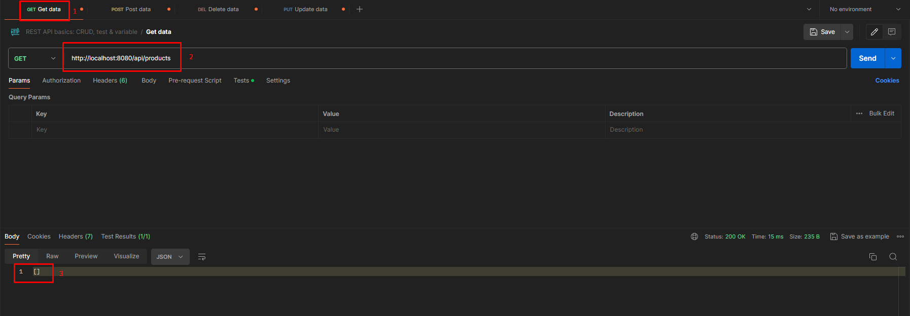
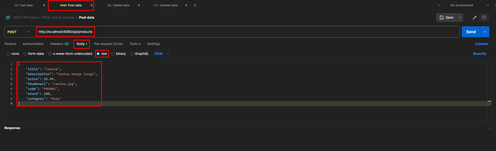
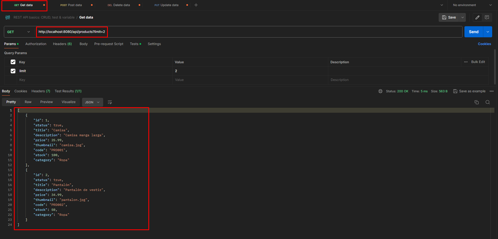
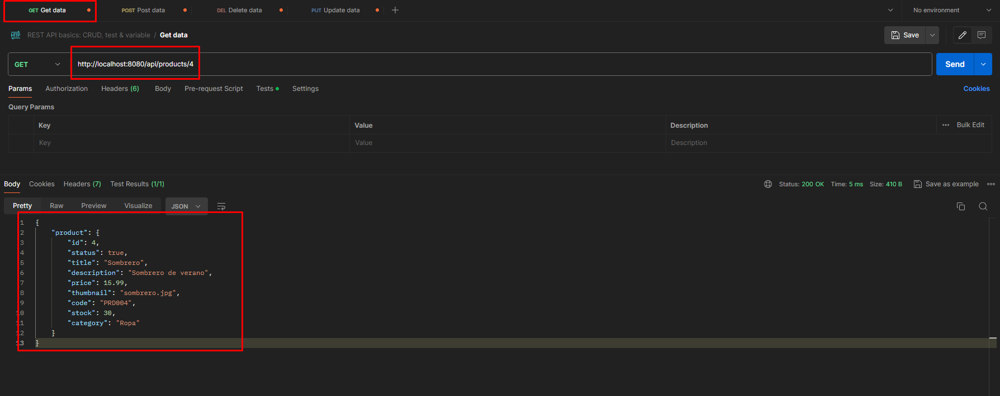
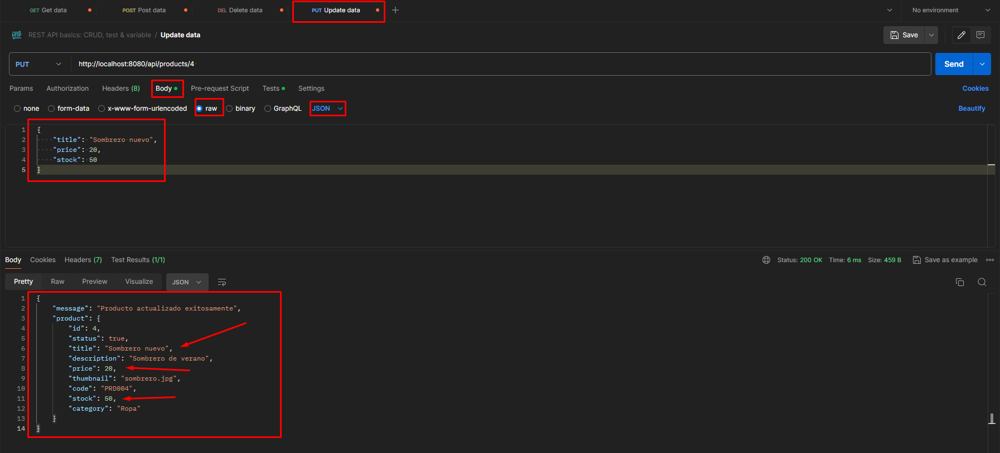
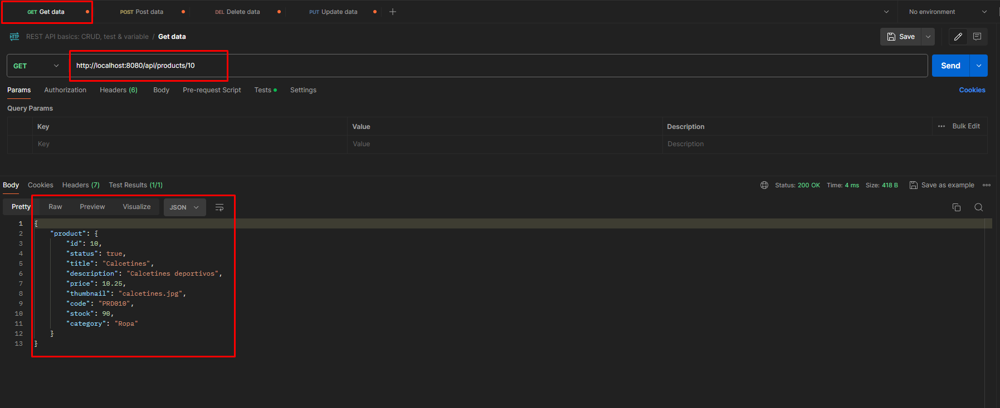
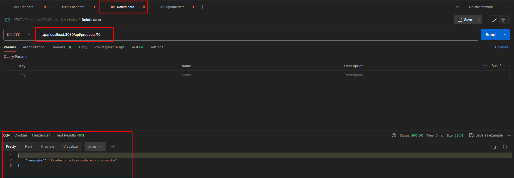

## Proyecto de BACKEND

Esta es una similacion de manejo de productos y carrito

Para iniciar la aplicación tienen que poner en la consola el comando

- npm start

Una ves que la consola ponga el msg Servidor iniciado en el puerto 8080 nuestra app esta en funcionamiento

## Utilizando POSTMAN
### Mostrar productos de la APP
Para saber si tenemos algun producto en nuesta app tenemos que utilizar la funcion GET con la direccion q apunta a nuestra lista de productos la cual es http://localhost:8080/api/products a continuacion dejo una imagen de ejemplo: 



- La imagen con el n°1 hace referencia a la funcion GET la cual debemos utilizar para traer todos los productos de nuestra app 
- La imagen con el N°2 es nuestra URL 
- La imagen con el N°3 es la lista de productos

### Como agregar productos

Para agegar productos en nuestra app, vamos a utilizar POSTMAN y con la funcion POST vamos a apuntar a nuesta URL http://localhost:8080/api/products, alli tenemos que elegir la opcion Body y seguido la opcion RAW con el formato JSON, a continuacion agregamos un producto el cual debe tener ciertas especificaciones, las cuales dejo a continuacion:

```
{
    "title": "Camisa",
    "description": "Camisa manga larga",
    "price": 25.99,
    "thumbnail": "camisa.jpg",
    "code": "PRD001",
    "stock": 100,
    "category": "Ropa"
}
```




### Mostrando producto especifico de la app

Luego de agregar varios productos, podriamos mostrar un producto en especifico si asi lo quisieramos utilizando el ID de dicho producto, o si tenemos una lista amplia de productos podriamos usar un limite de productos a mostrar a continuacion dejo ejemplos: 

Si nuestra lista de productos es amplia debemos agregar a nuestra URL http://localhost:8080/api/products un querry de limite el cual por ejemplo para 2 productos quedaria asi http://localhost:8080/api/products?limit=2 



Para mostrarnos un producto en especifico conociendo su ID deberiamos usar la URL http://localhost:8080/api/products/4 por ejemplo para mostrar nuestro producto con numero 4



### Actualizar un producto de nuestra lista

Para actualizar un producto de la lista tendriamos que usar la funcion PUT en POSTMAN con la URL definiendo el producto con el ID que necesitamos actualizar, por ejemplo si queremos actualizar el producto 4 usamos la URL http://localhost:8080/api/products/4 seleccionamos Body con la opcion RAW en el formato JSON a continuacion actualizamos los campos que necesitamos del producto 4.
```
{
    "title": "Sombrero nuevo",
    "price": 20,
    "stock": 50
}
```


### Borrando un producto de la app

Para Borrar un producto de nuestra app debemos utilizar en POSTMAN la funcion DEL y en la URL definir que producto por su ID vamos a borrar en este caso por ejemplo eliminaremos el producto con el id 10 usando la url http://localhost:8080/api/products/10

Utilizo un GET para mostrar que existe



Lo elimino



Si hacen otro Get como en la primer imagen le indicara que el producto no fue encontrado.